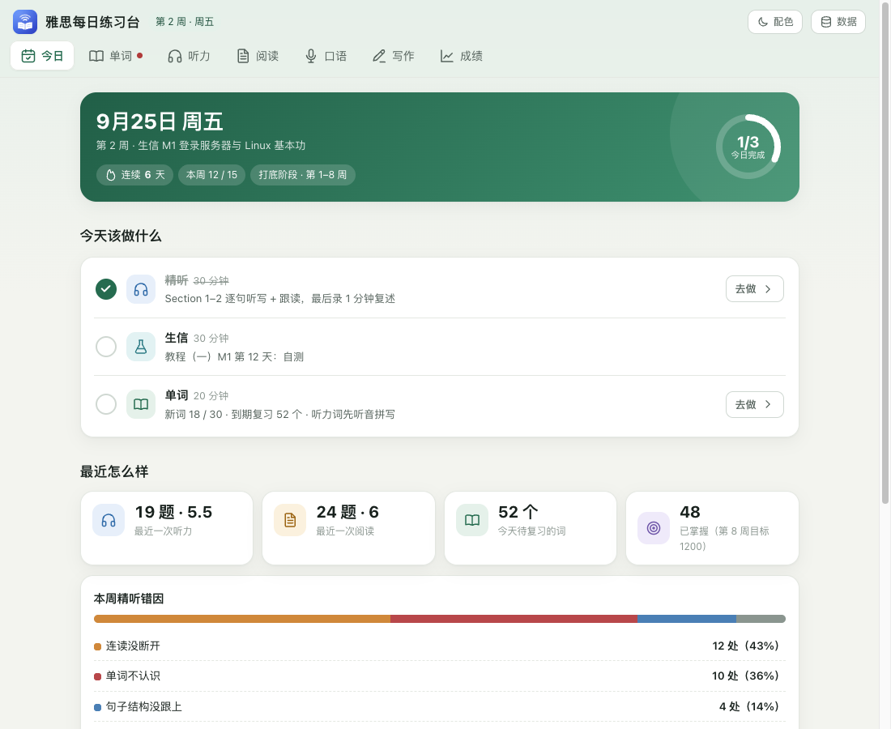
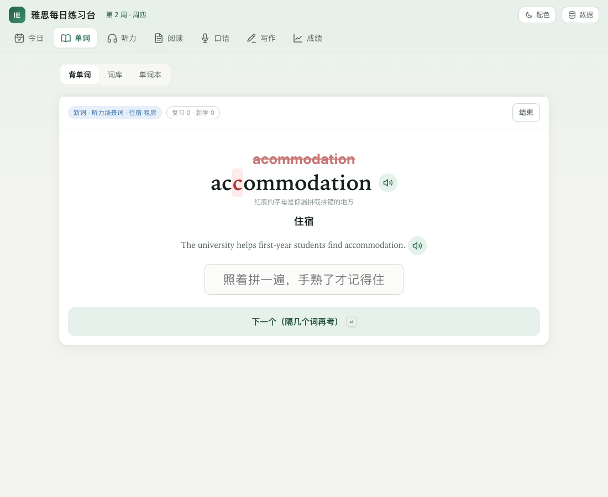
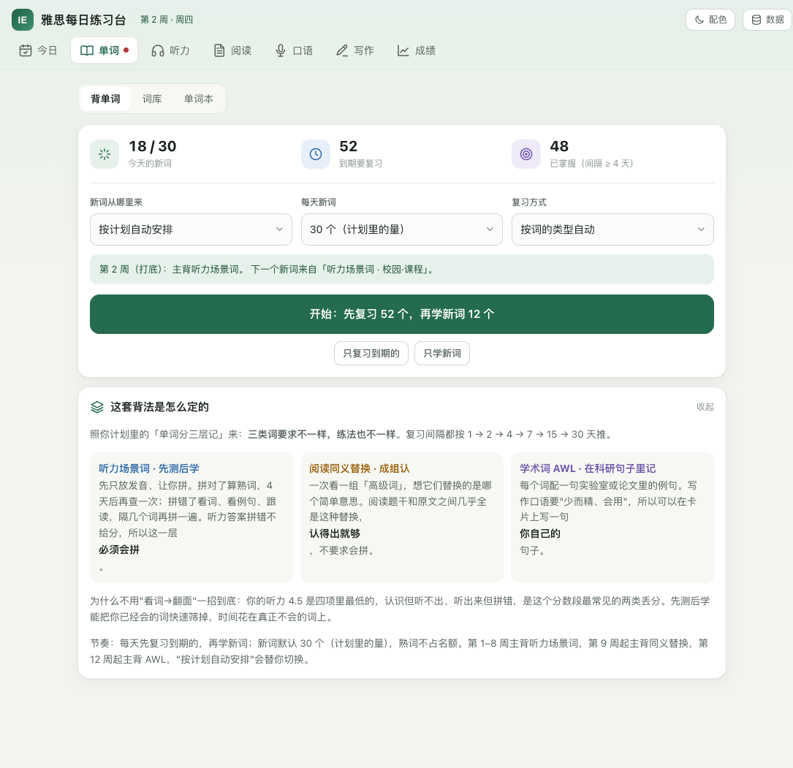
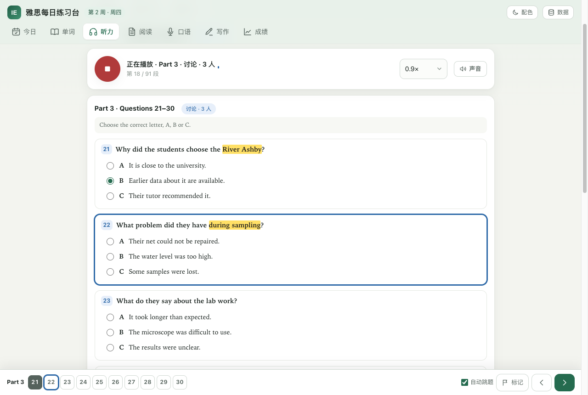
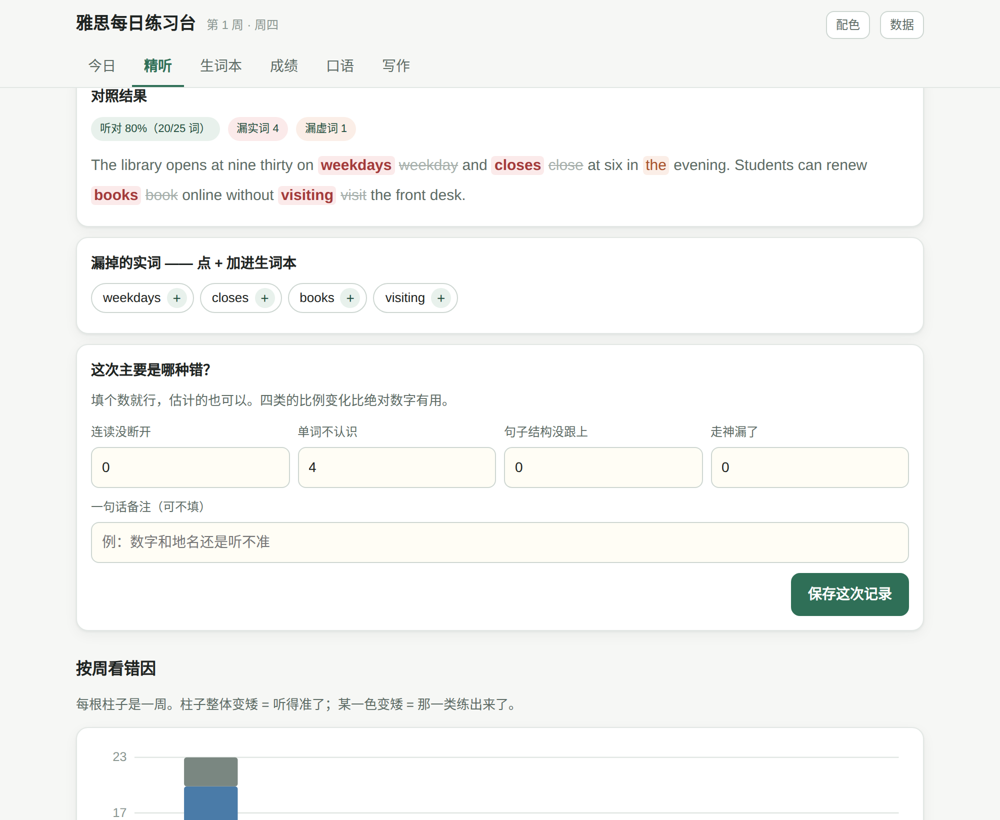
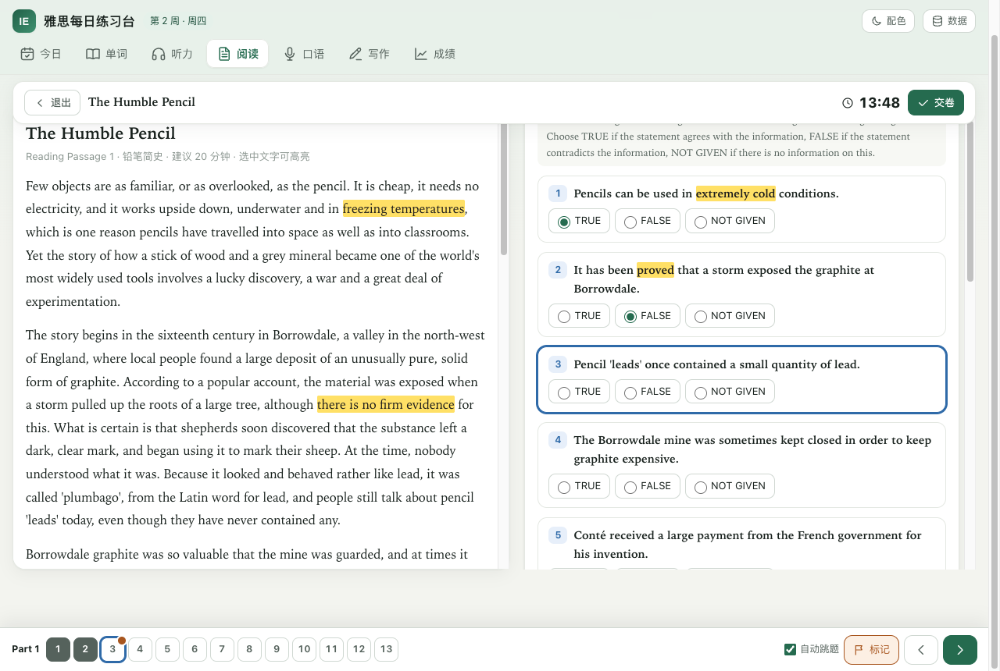

# 雅思每日练习台

一个单文件的雅思自学工具。下载 `index.html` 双击打开就能用 —— 不用装东西，不用注册，数据只存在你自己的浏览器里。

在线版：<https://zenix802.github.io/ielts-daily-lab/>（手机打开后「添加到主屏幕」，底部有标签栏，用起来跟 App 差不多）

## 它解决什么

雅思听力卡在 5 分上不去，通常不是"多听"能解决的。真正的问题是**不知道每次错在哪一类**：是连读没断开、单词不认识、句子结构没跟上，还是单纯走神。这个工具把每次精听的错误分成这四类记下来，按周画成柱状图 —— 两周之后你就能看见哪一类在变少、哪一类没动。

同样的逻辑用在成绩上：填答对题数而不是分数，因为"这次 21 题，离 6.5 还差 5 题"比"这次 5.5 分"具体得多。

## 七个板块

| | 做什么 |
|---|---|
| **今日** | 打开就知道今天练什么。按开始日期算出第几周、什么阶段，给出当天任务（含单词），点「去做」直接跳过去 |
| **单词** | 内置 3 个词库共 695 张卡，按"三层记法"背，间隔复习（1 → 2 → 4 → 7 → 15 → 30 天）。详见下文 |
| **听力** | 6 套原创听力（Test 1 整套 40 题 + 2 套 Section 1 专项）。和真题一样：Part 1 两人对话、Part 2 独白、Part 3 三人讨论、Part 4 讲座，**每个说话人用不同的声音**。做完题看带答案标记的原文，再**逐句精听**：一句一句听写、自动对照、跟读、记错因 |
| **阅读** | 原创学术类 Test 1：3 篇、40 题，题型和真题一致（判断、段落标题、单选、填空、句子配对）。限时作答，交卷后每题都有**原文依据 + 同义替换**，一点就在原文里标出来 |
| **口语** | Part 1/2/3 共 64 题，Part 2 自动 1 分钟准备 + 2 分钟作答并提示音；可录音，录音存在本机，过两周能回听 |
| **写作** | Task 1 限时 20 分钟 / Task 2 限时 40 分钟，实时字数，四项标准自评，历史作文可回看和复制 |
| **成绩** | 答对题数自动换算分数，画走势图带目标线；整套模考四项按雅思规则算总分（.25 进 .5，.75 进下一个整分）。内置整套题做完自动记进来 |

## 做题界面：照机考做

- **划词高亮**：选中文章或题目里的文字 → 点「高亮」（电脑上右键也行）；点已经高亮的地方可以清除。切换文章、交卷之后高亮都还在。
- **底部题号栏**：当前题有蓝框，做过的题变实心，标记过的题有橙点；左右箭头切上一题 / 下一题，点其他 Part 直接跳过去。
- **答完自动跳下一题**：选择题、判断题、配对题选完就跳（可以关）；填空题按回车跳。
- **阅读左右分栏**：左边原文、右边题目，各自滚动；手机上用「原文 / 题目」切换。
- **听力按 Part 翻页**：整套题一次只显示一个 Part，录音放到下一个 Part 时题目自动翻过去；放完有 2 分钟检查时间。
- 交卷后题号栏变成绿（对）/ 红（错），点题号直接看那题的解析。

## 单词怎么背：三层记法

不同的词要求不一样，练法也不一样：

| 词库 | 数量 | 要求 | 练法 |
|---|---|---|---|
| **听力场景词** | 272 词，11 个场景 | 必须会拼 —— 听力答案拼错不给分 | **先测后学**：只放发音让你拼。拼对算熟词，4 天后再查一次；拼错了用红底标出错在哪个字母，看例句、跟读、照着拼一遍，隔几个词再考 |
| **阅读同义替换** | 123 组 | 认得出就行 | **成组认读**：一次看一组高级词（crucial · vital · essential…），想它们替换的是哪个简单意思，翻面看"题干 → 原文"的替换示例 |
| **学术词表 AWL** | 300 词（子表 1–5） | 写作口语能用 | **在科研句子里记**：例句都放在实验室、测序和论文里，卡片上可以写一句你自己的句子 |

- 每天先复习到期的，再学新词。新词默认 30 个，可调；熟词不占名额，已经会的词不浪费时间。
- 「按计划自动安排」：第 1–8 周主背听力词，第 9 周起主背同义替换，第 12 周起主背 AWL。
- 精听里漏掉的实词、阅读解析里的同义替换，都能一键加进单词本，和词库的词一起复习。
- 英式、美式拼法都算对（neighbour / neighbor、licence / license）。
- 电脑上可以用键盘：`1` 不认识 / 想错了，`2` 认识 / 记住了，`Enter` 对答案 / 下一个。

更多截图

## 关于内置题目

- 听力、阅读的文章、题目和解析都是**原创**的，按真题的题型和难度写，不含剑桥真题内容。剑雅真题请配合「听力 → 精听对照」：把原文贴进来，一样逐词对照、记错因。
- 听力用**浏览器自带的语音合成**朗读。每个角色（女声、男声、第二女声、第二男声、旁白）自动分配不同的声音，尽量男女不同、口音不同（英式、澳洲、北美……真实考试里也是这样）；也可以在「听力 → 声音设置」里自己挑、试听。设备上英语声音太少时，那个面板里有 iPhone / Mac / Windows 下载声音的步骤。
- 机器朗读比真人录音清楚、没有背景音，分数会偏高 —— 拿它练流程、拼写和逐句精听，检查点的成绩以真题为准。
- 考试模式下交卷前只放一遍（可以关掉）；交卷后可以随便重听，也能从任意一句开始放。

## 你的数据在哪

**只在你这台设备的这个浏览器里**（localStorage + IndexedDB），不上传任何地方，我也看不到。

这意味着两件事：

1. **换设备不会自动同步。** 手机和电脑是两份独立数据。要搬的话：右上角「数据」→ 导出 JSON → 在另一台设备导入。
2. **清浏览器数据会清掉它。** 重要记录记得定期导出备份。

录音是例外：体积太大，不进导出的 JSON，只留在录它的那台设备上。

旧版本导出的 JSON 可以直接导入新版，打卡、精听、生词、成绩都会保留。

## 本地使用

下载 [`index.html`](index.html)，双击用浏览器打开。整个工具就这一个文件（约 330 KB），可以放 U 盘里带走。

## 说明

- 题数对照表用的是剑桥真题册里印的那种区间，实际考试每场略有浮动，只当参考。
- 朗读用浏览器的语音合成，Safari、Chrome、Edge 都行（Chrome 的 Google 英式声音需要联网）。刚打开页面时声音列表偶尔还没加载好，点一次播放通常就好了。
- 录音需要浏览器麦克风权限，用 `file://` 打开时部分浏览器会拒绝 —— 那就用上面的在线版。
- AWL 词条选自 Coxhead（2000）的 Academic Word List，释义和例句为本工具自编。

## 许可

MIT，随便用、随便改。
