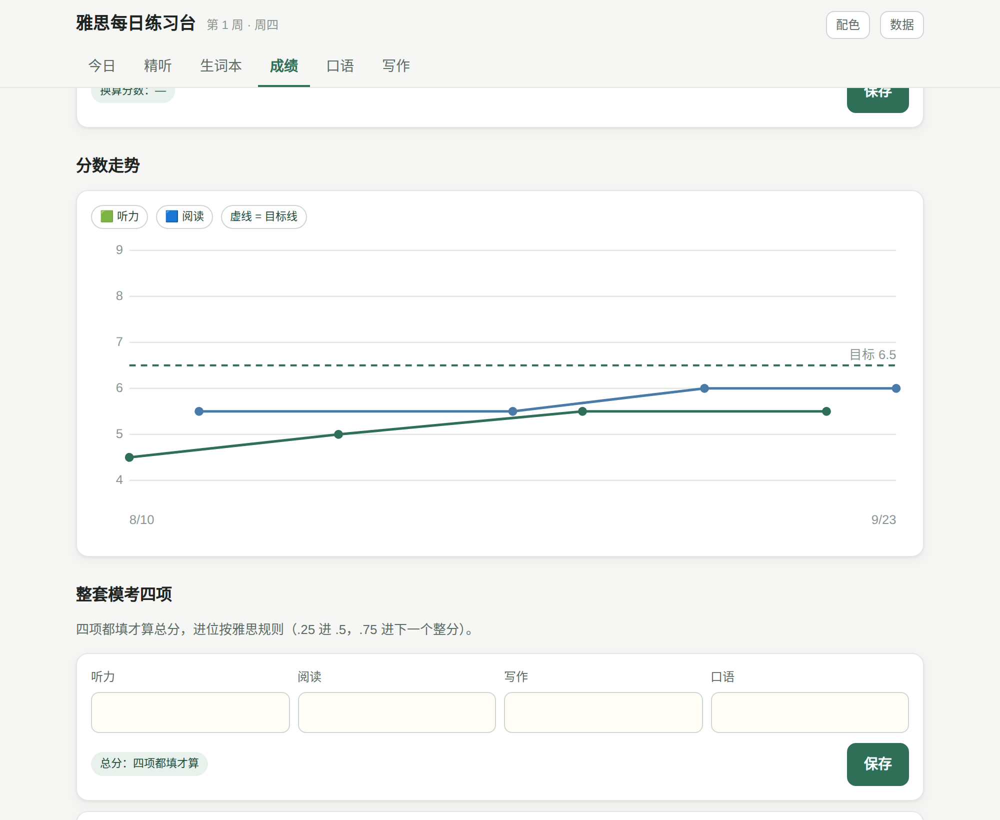

# 雅思每日练习台

一个单文件的雅思自学工具。下载 `index.html` 双击打开就能用 —— 不用装东西，不用注册，不联网，数据只存在你自己的浏览器里。

在线版：<https://zenix802.github.io/ielts-daily-lab/>

## 它解决什么

雅思听力卡在 5 分上不去，通常不是"多听"能解决的。真正的问题是**不知道每次错在哪一类**：是连读没断开、单词不认识、句子结构没跟上，还是单纯走神。这个工具把每次精听的错误分成这四类记下来，按周画成柱状图 —— 两周之后你就能看见哪一类在变少、哪一类没动。

同样的逻辑用在成绩上：填答对题数而不是分数，因为"这次 21 题，离 6.5 还差 5 题"比"这次 5.5 分"具体得多。

## 六个板块

| | 做什么 |
|---|---|
| **今日** | 打开就知道今天练什么。按你设定的开始日期算出第几周、什么阶段，给出当天任务并打勾 |
| **精听** | 贴原文 + 贴你的听写稿，自动逐词对照。**红色**是漏掉的实词（值得背），**橙色**是虚词（多半是连读吞音）；漏掉的实词一键加进生词本 |
| **生词本** | 间隔复习（1 → 2 → 4 → 7 → 15 → 30 天）。两种模式：看英文想意思，或听发音拼出来。答错的词退回第一档，**并在本轮末尾再考一次** |
| **成绩** | 答对题数自动换算分数，画走势图带目标线；整套模考四项按雅思规则算总分（.25 进 .5，.75 进下一个整分） |
| **口语** | Part 1/2/3 共 64 题，Part 2 自动 1 分钟准备 + 2 分钟作答并提示音；可录音，录音存在本机，过两周能回听 |
| **写作** | Task 1 限时 20 分钟 / Task 2 限时 40 分钟，实时字数，四项标准自评，历史作文可回看和复制 |

更多截图

## 你的数据在哪

**只在你这台设备的这个浏览器里**（localStorage + IndexedDB），不上传任何地方，我也看不到。

这意味着两件事：

1. **换设备不会自动同步。** 手机和电脑是两份独立数据。要搬的话：右上角「数据」→ 导出 JSON → 在另一台设备导入。
2. **清浏览器数据会清掉它。** 重要记录记得定期导出备份。

录音是例外：体积太大，不进导出的 JSON，只留在录它的那台设备上。

## 本地使用

下载 [`index.html`](index.html)，双击用浏览器打开。整个工具就这一个文件，可以放 U 盘里带走。

手机上想用的话，开着上面那个在线版，加到主屏幕即可。

## 说明

- 题数对照表用的是剑桥真题册里印的那种区间，实际考试每场略有浮动，只当参考。
- 听音拼写用浏览器自带的语音合成，优先选英式发音；没有英式音的设备会退回默认英语音。
- 录音需要浏览器麦克风权限，用 `file://` 打开时部分浏览器会拒绝 —— 那就用上面的在线版。

## 许可

MIT，随便用、随便改。
